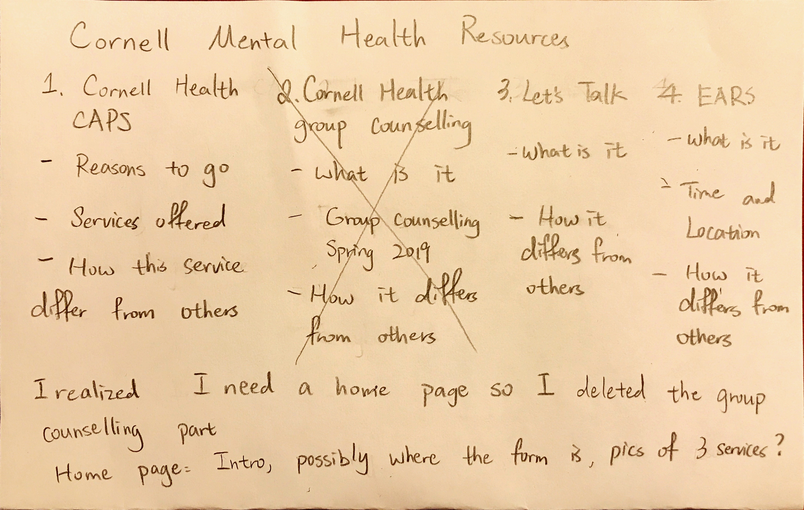
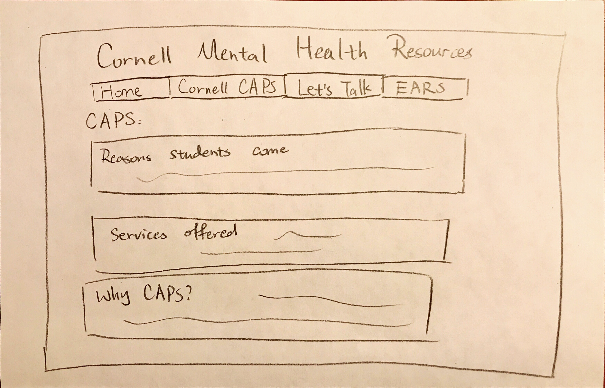
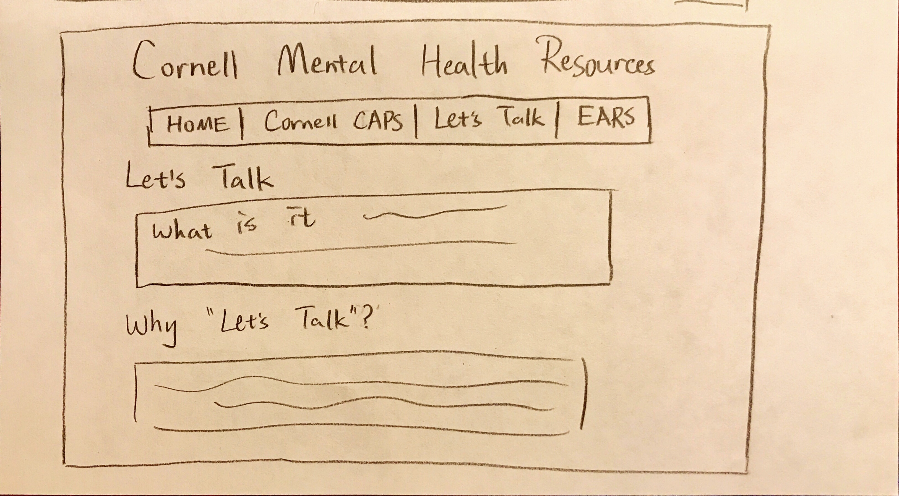
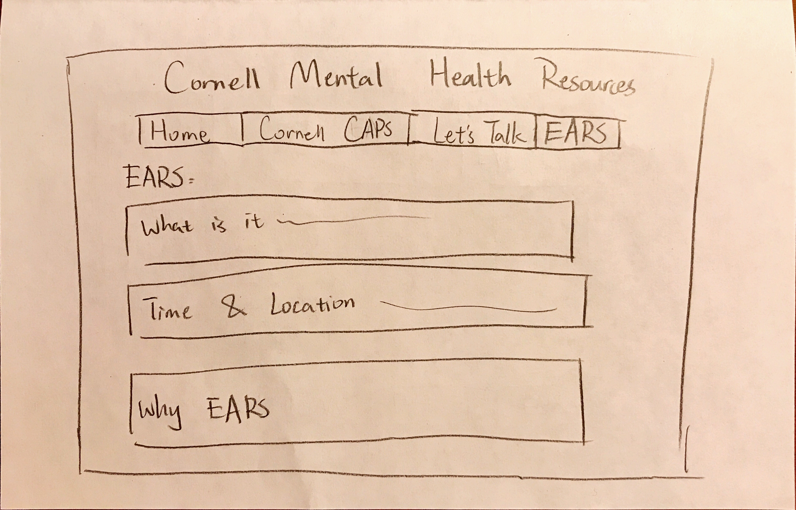
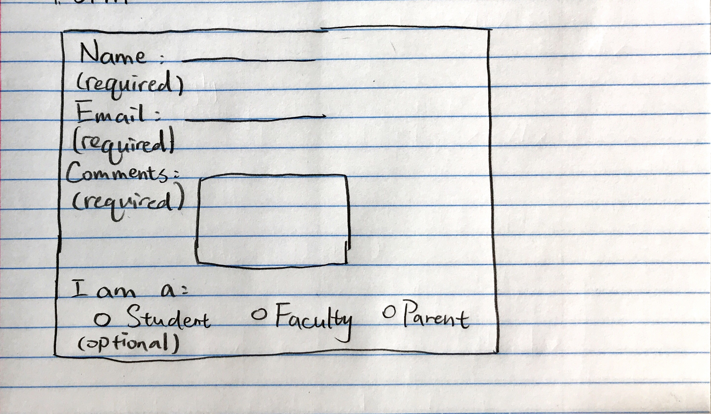
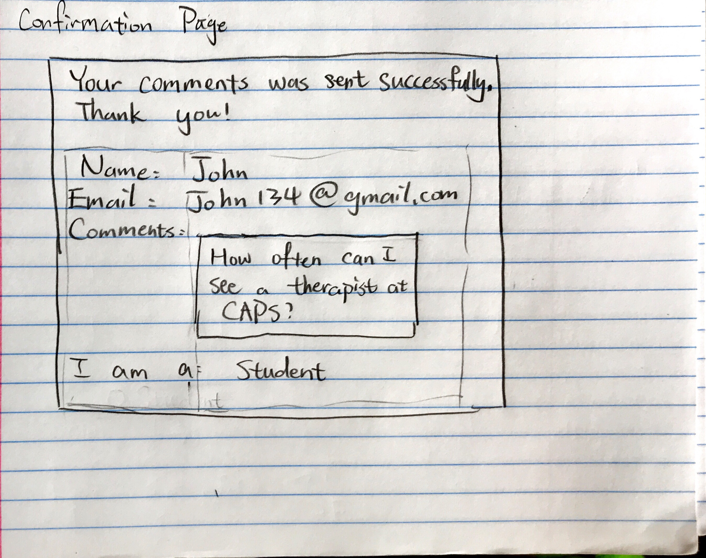

# Project 1: Design Journey

Your Name: Yiqing Luo

**All images must be visible in Markdown Preview. No credit will be provided for images in your repository that are not properly linked in Markdown. Assume all file paths are case sensitive!**

## Markdown (DELETE ME)

# Project 1, Milestone 1 - Design & Plan

## Website Topic

[Tell us what your website is about. What are you promoting?]

The website aims to promote Cornell members' awareness to care for their own or other people's mental health. It collects general information and directs users to 3 of the most popular mental health counselling services on campus, along with suggestions on how to choose between them.

## Target Audiences

[Tell us about your two target audiences.]

1. Cornell students that need mental health support themselves, or students who are worried about their friends' mental health.

2. Parents and faculties who know students in need of mental health support and wish to refer or guide them to these services.

Both of the audiences are actively seeking on-campus mental health services, but know little about mental health support in general, did not realize there are alternative options, or having trouble distinguishing what is best for them.

## Design Process

[Document your design process. Show us your sketches. Show us your card sorting. Show us the evolution of your design from your first idea (sketch) to design you wish to implement (sketch). Show us the process you used to organize content and plan the navigation (card sorting).]

[Thoroughly document this process. The _process_ is the important part of this assignment, not the final result.]

## Final Design Plan

[Include sketches of your final design here. Don't forget to design the form and its confirmation page!]

This is home page.

This is a page about Cornell Health CAPS service.

This is a page about Let's Talk walk-in counseling.

This is a page about EARS student counseling service.

This is the form design.

This is the confirmation page design.

[Include your site navigation here. Describe the content on each page. Tip: use bulleted lists.]

Home
- A sentence to encourage people to seek help
- Purpose of the website
- Pictures of the 3 services that link to the specific page (TBD)
- Comment form

Cornell Health
- Some reasons students come in for help
- Services offered
- Why choose CAPS

Let's Talk
- What is it
- Why choose Let's Talk
- Time and location(TBD)

EARS peer counselling
- What is it
- Time and location
- Why choose EARS

## Target Audiences' Needs

[Tell us how your design meets the needs of both of your target audiences.]

Although all 3 services can be found on Cornell Health's website, there are also too much information on the same page and hard for someone who is new to mental health support to navigate. Students, faculty and parents who had no experience or exposure to mental health support may find it hard to distinguish different services and find what is best for their needs.

The website picks and introduces 3 of the most popular resources on Cornell campus in separate pages, also providing the most essential information. The design will be concise and the material will not be too long because it aims to provide a straight-forward guide to the audience. It also offers suggestions on the difference between these services, because not all people need one-on-one therapy.

## Templates

[Now that you've finalized your design, identify the templates you will use on your site.]

1. Navigation bar.

2. A footer with link to the each service's website at bottom of corresbonding service's page

# Project 1, Milestone 2 - Draft Website

## Sticky Form

[What fields are required for your form?]

Name, email and message

[Plan out your error messages for your target audiences here.]

Name error: Please type your name here

Email: Please input a valid email

Message: Please put down the message you would like to send in the textbox.

## Validation Code Plan

[Write out your pseudocode plan for handling the validation of the form.]

form_validate=TURE

if Name is empty, name_validate=FALSE

if Email is not valid, email_validate=FALSE

if Message is empty, message_validate=FALSE

else go to confirmation page

# Final Submission: Complete & Polished Website

## Target Audiences

[Tell us how your final site meets the needs of the target audiences. Be specific here. Tell us how you tailored your design, content, etc. to make your website usable by both target audiences.]

My two target audiences are: 1. Cornell students seeking mental health help on campus or being concerned about a friend; 2. parents and faculties who know a Cornell student in need for mental health support. Both of the audiences are not familiar, or don't know how to distinguish the different mental health support on campus. Thus the website is designed to introduce them to the most popular three services on campus, and some tips on when and how to use them effectively.
Since all three services have official websites that contain thorough details, I only included the most essential information of each service on my website, such as what the service is and time and location.
I made the design simple so that the content stands out. I used a calming green-bluish color, and sans-serif fonts to make users feel more relaxed and welcomed. The overall tone of the content is colloquial, encouraging users to seek help and not to be afraid.
I made a "contact us" form so that users can send me messages if they have more concerns, comments, or questions to help me improve my website and provide more support.

## Reflection

[Take this time to reflect on what you learned during this assignment. How have you improved from 1300? What things did you have trouble with?]

I have learnt to use templates for repeating materials, and I have improved from 1300 in that I made my code look cleaner with different tags. I struggled with making different form elements sticky(such as buttons and textarea), because it was not taught in class and online tutorials don't work sometimes, and I am stuck on one or two simple lines of code longer than I wish to.
